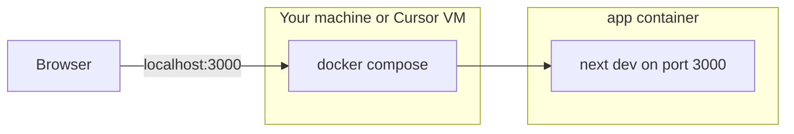

# starter-logo

A minimal **Next.js** front-end app with **Docker Compose** and **Cursor Cloud Agent** support.

Click the **"New App"** heading to add animated comet dots.

This README focuses on running the **frontend in Docker**. Database and Prisma setup comes in a follow-up PR.

---

## Tech stack

| Tool | Purpose |
|------|---------|
| **Next.js 16** | React framework with file-based routing |
| **React 19** | UI components |
| **Tailwind CSS 4** | Styling |
| **Docker Compose** | Run the dev server in a container |
| **Cursor Cloud Agents** | Automated cloud dev environment |

---

## Project structure

```
starter-logo/
├── pages/
│   ├── index.js          # Home page (comet animation)
│   └── _app.js           # App wrapper, global CSS import
├── assets/style/
│   └── main.css          # Global styles
├── .cursor/
│   ├── environment.json  # Cursor Cloud Agent boot config
│   └── install.sh        # Installs Docker on cloud VM
├── docker-compose.yml    # Defines the app service
├── Dockerfile            # Builds the Next.js container image
├── .env.example          # Default environment variables
└── package.json          # npm scripts
```

---

## How Docker fits in



- **`Dockerfile`** — recipe to build the app image (Node 24 + npm dependencies)
- **`docker-compose.yml`** — runs the app container with port mapping and hot reload
- **`.cursor/install.sh`** — prepares the Cursor Cloud VM (installs Docker, creates `.env`)

There is only **one** Dockerfile in this PR: the app image at the project root.

---

## Environment variables

| Variable | Default | Purpose |
|----------|---------|---------|
| `APP_PORT` | `3000` | Port on your machine |
| `WATCHPACK_POLLING` | `true` | Better file watching inside Docker |

Create your local file:

```bash
cp .env.example .env
```

---

## Run locally

### Prerequisites

- [Docker](https://docs.docker.com/get-docker/) with Docker Compose

### Quick start

```bash
cp .env.example .env
npm run up
```

Open [http://localhost:3000](http://localhost:3000)

### Commands

| Command | What it does |
|---------|--------------|
| `npm run up` | Start the app container in background |
| `npm run down` | Stop the container |
| `npm run logs` | Follow container logs |
| `npm run dev` | Start Next.js directly (used inside the container) |

### Stop

```bash
npm run down
```

---

## Why `next dev --hostname 0.0.0.0`?

Inside Docker, `next dev` must listen on **all interfaces** (`0.0.0.0`), not only `localhost`.

Otherwise port mapping `3000:3000` works, but your browser cannot reach the app.

---

## Cursor Cloud Agents

On boot, Cursor runs:

1. `.cursor/install.sh` — create `.env`, install Docker (once)
2. `docker compose up -d --build` — build and start the app
3. Port `3000` is forwarded to you

### `environment.json`

```json
{
  "install": "bash .cursor/install.sh",
  "start": "sudo service docker start && sudo docker compose up -d --build"
}
```

No `npm ci` on the host VM — dependencies install inside the container image during `docker compose build`.

---

## Development notes

### Hot reload

Compose mounts your source code into the container:

```yaml
volumes:
  - .:/app
  - /app/node_modules
```

Edit files locally; Next.js reloads inside the container.

### Rebuild after dependency changes

If you change `package.json`:

```bash
docker compose up -d --build
```

---

## Troubleshooting

### Port 3000 already in use

Set another port in `.env`:

```env
APP_PORT=3001
```

### Changes not appearing

Rebuild:

```bash
docker compose up -d --build
```

### View logs

```bash
npm run logs
```

---

## License

ISC
